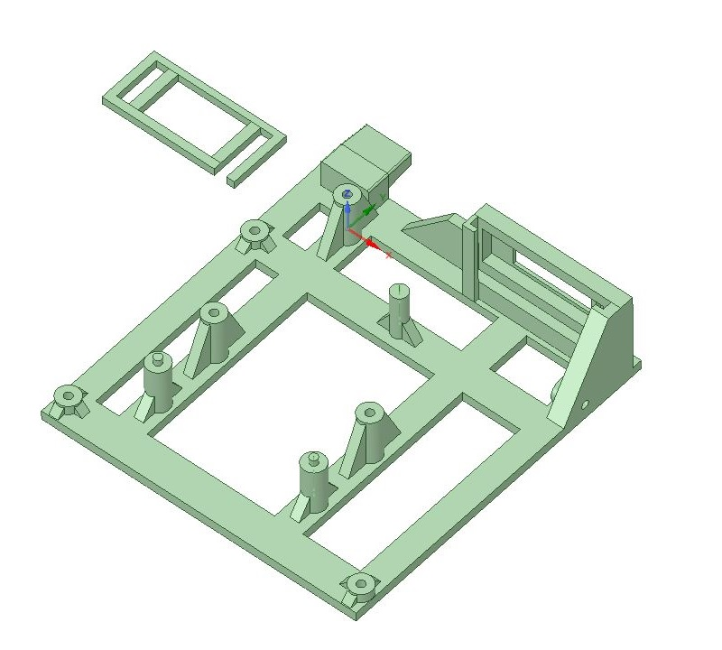
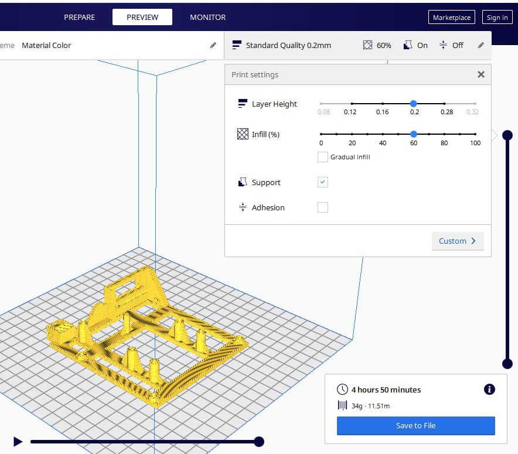

# Gotek_internal_A500_mount
An internal Gotek mounting bracket for Amiga 500 designed in DesignSpark Mechanical 4.0

I was not happy with the internal mount I got when buying a Gotek floppy emulator for the Amiga 500. I did a respin to better position the usb socket and the display and to fit both the revision A and B of the A500 and A500+ Cases. This is the result. You don't have to modify your case in any way for the Gotek to fit with this mount.

***

To 3d-print this model it takes about 5 hours with Standard Quality 0.2mm, 60% infill, using a Ender 3 Pro printer. It uses around 12 meters (35 gram) of filament.

***
