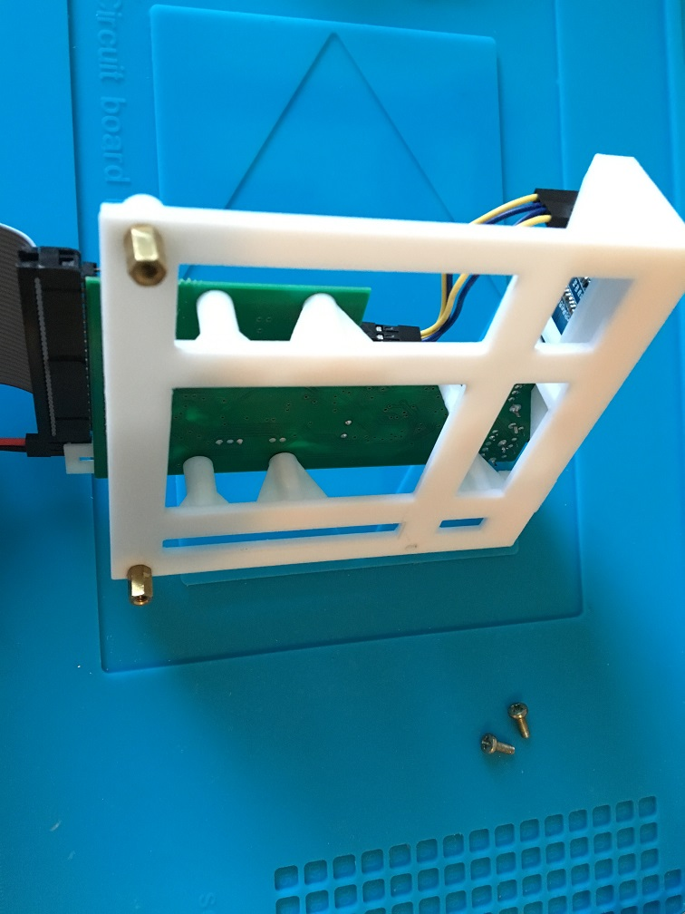
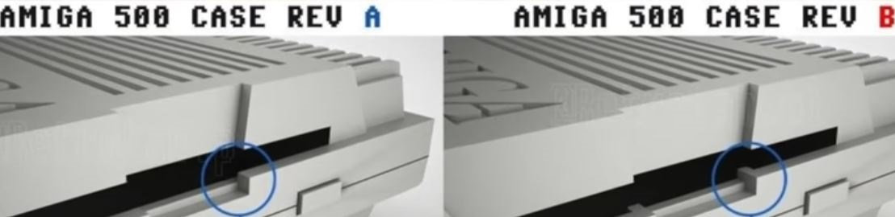

# Gotek_internal_A500_mount
An internal Gotek mounting bracket for the Amiga 500 designed in DesignSpark Mechanical 4.0

I was not happy with the internal mount I got when buying a Gotek floppy emulator for the Amiga 500. I did a respin to better position the usb socket and the display and to fit both the revision A and B of the A500/500+ Cases. This is the result. You don't have to modify your case in any way for the Gotek to fit with this mount, and the standard 34-pin floppy cable can be used as it just about reaches the Gotek. It sits a few mm back compared to the other mount.

***

To 3d-print this model it takes about 5 hours with Standard Quality 0.2mm, 60% infill, using an Ender 3 Pro printer. It uses around 12 meters Ø1.75mm (35 grams) of filament.

 

***
The result of the printout, the little plastic piece is used to secure the oled display and keep it in its housing.

***

Add two standoffs, one on each side of the rear side of the mount. Use an Iron to heat the little badger up and push it in a bit as the plastic melts, then screw it in the last bit until firmly seated in end position. The standoff is 8mm high (~12mm with the screw part included).

 

***

Now fit the Gotek pcb in the mount and put three screws (black in picture) to tighten it. Fit the display by gently pressing it into place and put the little plastic piece as a stopper behind it.

***

Now time to see how well this new mount + Gotek fits in the different A500 Cases.

 

First let's try to fit it in a REV B Case, this is A500+ and the A500s with the rectangular "Commodore A-500" badge on case:

***

Nice, and now in a REV A Case:

Sweet!, and no problem closing either of the cases. Mission accomplished!
